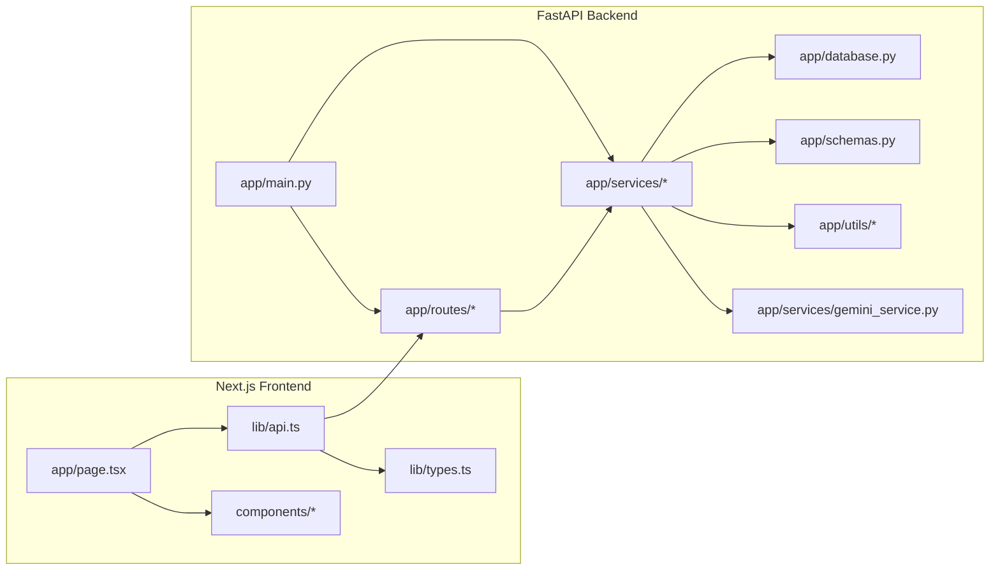

# Codex 2.0: Full Folder Analysis (gfg)

This document maps how files connect, why they exist, and which files are unused or framework-only. Scope is the entire `gfg` folder.

## Current Project Status (March 2026)

### Recent Changes
The project has undergone several bug fixes and improvements:

1. **FIX #5** - `frontend/lib/api.ts`: Fixed upload URL handling to read from environment variable (`NEXT_PUBLIC_UPLOAD_URL` or `NEXT_PUBLIC_BACKEND_URL`), with proper fallback logic for local dev vs production.

2. **FIX #6** - `backend/app/services/dashboard_engine.py`: Empty/missing SQL from Gemini now generates a safe fallback SQL query instead of silently dropping the chart.

3. **FIX #7** - `backend/app/services/sql_validator.py`: SQL comments are now stripped before validation instead of raising errors. This prevents valid queries from being rejected due to Gemini's inline comments.

4. **FIX #8** - `frontend/app/page.tsx`: Removed unused imports (Sidebar, Navbar, and unused lucide icons: BarChart3, TrendingUp, Users, DollarSign, ArrowUpRight, ArrowDownRight, MessageSquare, Send).

5. **Environment Configuration** - Updated `.env.example` files with proper defaults:
   - Root `.env.example`: Added Gemini API key
   - `backend/.env.example`: Added CORS origins for ports 3000/3001, timeout settings

### Configuration Defaults
- **Gemini Model**: `gemini-2.0-flash`
- **Gemini Timeout**: 15 seconds
- **CORS Origins**: `http://localhost:3000,http://127.0.0.1:3000,http://localhost:3001,http://127.0.0.1:3001`
- **Max Upload Size**: 50MB (52428800 bytes)

## Scope and Exclusions
The analysis focuses on source code and configuration. These paths are **not** treated as source dependencies:
- `ai-nl-analytics-dashboard/frontend/node_modules/**` (third-party packages)
- `.venv/**` (local Python env)
- `**/__pycache__/**`, `**/*.pyc` (bytecode)
- `**/*.log` (runtime logs)
- `**/*.db` (runtime databases)
- `**/*.csv` (data assets, not code)

## High-Level Architecture Map

```
Next.js Frontend (ai-nl-analytics-dashboard/frontend)
  app/page.tsx
    -> lib/api.ts (HTTP calls)
    -> backend API (FastAPI)

FastAPI Backend (ai-nl-analytics-dashboard/backend)
  app/main.py
    -> routes/*
      -> services/*
        -> database.py (SQLite)
        -> schemas.py (Pydantic contracts)
        -> utils/*
    -> services/gemini_service.py (LLM)
```

### Visual Graph (Mermaid)



Runtime flow:
1) UI calls `listDatasets`, `uploadCsv`, `generateDashboard`, `followUp`.
2) FastAPI routes call services.
3) Services read/write SQLite and optionally call Gemini for plan/insights.
4) Response JSON returns to frontend to render charts/tables.

## Backend Dependency Graph (Imports)

Entry point:
- `ai-nl-analytics-dashboard/backend/app/main.py`
  - imports `app.config`, `app.database`
  - imports routers: `app.routes.health`, `app.routes.upload`, `app.routes.dashboard`, `app.routes.chat`
  - calls `app.services.dataset_registry.ensure_demo_dataset_loaded`

Routers:
- `backend/app/routes/health.py`
  - no internal imports (simple health response)
- `backend/app/routes/upload.py`
  - imports `app.schemas`
  - imports `app.services.csv_service`
  - imports `app.services.dataset_registry`
- `backend/app/routes/dashboard.py`
  - imports `app.schemas`
  - imports `app.services.dashboard_engine`
- `backend/app/routes/chat.py`
  - imports `app.schemas`
  - imports `app.services.dashboard_engine`

Core services:
- `backend/app/services/dashboard_engine.py`
  - imports `app.schemas`
  - imports `app.services.dataset_registry`
  - imports `app.services.gemini_service`
  - imports `app.services.sql_validator`
  - imports `app.services.query_executor`
  - imports `app.services.chart_selector`
  - imports `app.services.session_service`
- `backend/app/services/gemini_service.py`
  - imports `app.config`
  - imports `google.generativeai` (runtime dependency)
- `backend/app/services/csv_service.py`
  - imports `app.config`
  - imports `app.schemas`
  - imports `app.services.dataset_registry`
  - uses `pandas`, `chardet`
- `backend/app/services/dataset_registry.py`
  - imports `app.database`
  - imports `app.schemas`
  - imports `app.services.schema_profiler`
  - imports `app.utils.column_sanitizer`
  - uses `pandas`
- `backend/app/services/query_executor.py`
  - imports `app.database`
- `backend/app/services/sql_validator.py`
  - imports `sqlparse`
- `backend/app/services/chart_selector.py`
  - uses `pandas` to pick chart type from data
- `backend/app/services/session_service.py`
  - no internal imports (in-memory session store)
- `backend/app/services/schema_profiler.py`
  - imports `app.schemas`
  - imports `app.utils.date_utils`

Database + schemas + utils:
- `backend/app/database.py` -> `app.config`
- `backend/app/config.py` -> env-based settings
- `backend/app/schemas.py` -> shared API contracts
- `backend/app/utils/column_sanitizer.py` -> identifier cleaning used by registry
- `backend/app/utils/date_utils.py` -> date detection used by schema profiler
- `backend/app/utils/response_helpers.py` -> not used by any module

## Frontend Dependency Graph (Imports)

App entry:
- `frontend/app/layout.tsx`
  - imports `./globals.css`
  - imports `next/font/google`

Main UI:
- `frontend/app/page.tsx`
  - imports `../components/layout/Sidebar`
  - imports `../components/layout/Navbar`
  - imports `../components/dashboard/FileUpload`
  - imports `../components/SqlPanel`
  - imports `../components/ChartRenderer`
  - imports `../components/DataTable`
  - imports `../lib/api`
  - imports `../lib/types`
  - uses `lucide-react`, `clsx`, React hooks

Components:
- `frontend/components/ChartRenderer.tsx`
  - imports `../lib/types`
  - imports `./DataTable`
  - uses `recharts`
- `frontend/components/DataTable.tsx`
  - no internal imports
- `frontend/components/SqlPanel.tsx`
  - imports `../lib/types`
- `frontend/components/dashboard/FileUpload.tsx`
  - imports `../../lib/api`
  - imports `../../lib/types`

API + types:
- `frontend/lib/api.ts` -> `frontend/lib/types`
- `frontend/lib/types.ts` -> pure type definitions

Framework files (Next.js conventions):
- `frontend/app/error.tsx`
- `frontend/app/global-error.tsx`
- `frontend/app/not-found.tsx`
These are used by Next.js via filename conventions, not explicit imports.

## File-by-File Purpose and Logic

Top-level:
- `package.json`: placeholder project manifest. Not used by backend/frontend runtime.

Backend:
- `backend/app/main.py`: FastAPI app creation, middleware setup, route registration, and demo dataset preload.
- `backend/app/config.py`: environment-driven settings for SQLite path, CORS, upload limits, and Gemini config. Defaults: `gemini-2.0-flash`, 15s timeout.
- `backend/app/database.py`: SQLite connections, table setup, safe identifier quoting, schema inspection, preview fetch.
- `backend/app/schemas.py`: Pydantic models for request/response payloads.
- `backend/app/routes/health.py`: health check endpoint.
- `backend/app/routes/upload.py`: CSV upload and dataset metadata endpoints.
- `backend/app/routes/dashboard.py`: dashboard generation entrypoint.
- `backend/app/routes/chat.py`: follow-up refinement entrypoint.
- `backend/app/services/dashboard_engine.py`: orchestrates plan -> SQL -> query -> chart -> insights -> session. **FIX #6**: Generates fallback SQL when Gemini returns no SQL field.
- `backend/app/services/gemini_service.py`: Gemini API calls with retry and strict JSON responses.
- `backend/app/services/csv_service.py`: upload validation + CSV parse + register dataset.
- `backend/app/services/dataset_registry.py`: in-memory dataset registry + SQLite persistence; loads demo dataset.
- `backend/app/services/query_executor.py`: executes validated SELECT queries.
- `backend/app/services/sql_validator.py`: strict SQL safety validation and normalization. **FIX #7**: Strips SQL comments before validation.
- `backend/app/services/chart_selector.py`: deterministic chart type choice from query result shape.
- `backend/app/services/session_service.py`: in-memory session store for follow-ups.
- `backend/app/services/schema_profiler.py`: infers numeric/categorical/date columns and preview rows.
- `backend/app/utils/column_sanitizer.py`: cleans and dedupes column names.
- `backend/app/utils/date_utils.py`: detects datetime-like columns.
- `backend/app/utils/response_helpers.py`: helper for error payloads (unused).

Frontend:
- `frontend/app/layout.tsx`: global layout, fonts, and metadata.
- `frontend/app/page.tsx`: main UI, state, dataset selection, dashboard rendering, follow-up flow. **FIX #8**: Removed unused imports.
- `frontend/app/error.tsx`: per-route error UI.
- `frontend/app/global-error.tsx`: app-level error UI.
- `frontend/app/not-found.tsx`: 404 UI.
- `frontend/components/ChartRenderer.tsx`: render charts or table from `ChartSpec`.
- `frontend/components/DataTable.tsx`: generic table for row arrays.
- `frontend/components/SqlPanel.tsx`: collapsible SQL transparency panel.
- `frontend/components/dashboard/FileUpload.tsx`: CSV upload UI and interaction.
- `frontend/lib/api.ts`: API calls to backend endpoints. **FIX #5**: Fixed upload URL handling for production/local dev.
- `frontend/lib/types.ts`: shared TS types matching backend schemas.

Config:
- `frontend/package.json`: frontend scripts and dependencies (Next.js, Recharts, etc).
- `backend/requirements.txt`: backend deps (FastAPI, pandas, sqlparse, Gemini).
- `frontend/next.config.js`, `frontend/tsconfig.json`, `frontend/tailwind.config.js`, `frontend/postcss.config.js`, `frontend/next-env.d.ts`: build/tooling configs.

## Unused or Not Referenced by Code

Backend (unused modules):
- `backend/app/services/sql_guard.py`: never imported; superseded by `sql_validator.py`.
- `backend/app/services/csv_handler.py`: never imported; superseded by `csv_service.py`.
- `backend/app/utils/response_helpers.py`: never imported.

Backend data artifacts:
- `backend/data/app.db`: not referenced; actual path is `./data/app_data.db` via `config.py`.
- `backend/data/app_data.db`: runtime DB file, not source code.
- `backend/data/demo/demo_sales.csv`: data asset used by `dataset_registry` when present.

Frontend (previously unused, now cleaned up):
- `frontend/components/dashboard/ChartCard.tsx`: not imported anywhere.
- `frontend/components/FileDropzone.tsx`: not imported anywhere.
- `frontend/components/layout/Navbar.tsx`: FIX #8 - import removed from `app/page.tsx`.
- `frontend/components/layout/Sidebar.tsx`: FIX #8 - import removed from `app/page.tsx`.

Root-level data assets (not code):
- `ai-nl-analytics-dashboard/sample_sales_data.csv`: only used if backend runs with CWD at repo root; otherwise unused.
- `ai-nl-analytics-dashboard/demo_sales.csv`: not referenced by backend loader paths.
- `ai-nl-analytics-dashboard/sample_sales_data.csv` (and `demo_sales.csv`): data assets, not code dependencies.

Logs and bytecode:
- `backend/*.log`, `frontend/*.log`, `**/*.pyc`, `**/__pycache__/**`: runtime artifacts only.

## Notes on Cross-Project Coupling

Contract coupling:
- `backend/app/schemas.py` and `frontend/lib/types.ts` mirror each other. Changes to API fields require updates in both.

API routing:
- Frontend uses `NEXT_PUBLIC_API_URL` (defaults to `/api`).
- Upload endpoint uses `NEXT_PUBLIC_UPLOAD_URL` or `NEXT_PUBLIC_BACKEND_URL` (defaults to `http://localhost:8000` for local dev).
- If there is no proxy, the backend must be reachable at that base.

Gemini dependency:
- `GEMINI_API_KEY` is required for plan and insight generation, but the backend has fallbacks for plan/insight failure.
- Current default model: `gemini-2.0-flash`


  .\.venv\Scripts\Activate.ps1; python -m uvicorn app.main:create_app --factory --reload --host 0.0.0.0 --port 8000     


ollama launch claude --model qwen3.5


ollama launch claude --model minimax-m2.5:cloud